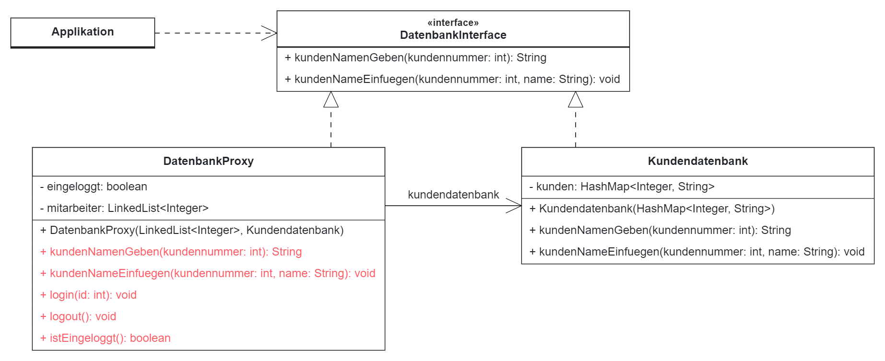

# proxy-pattern

## Aufgabe
Implementiere die markierten Methoden!

## Hinweis
Zur leichteren Lesbarkeit wurde das generische Maskulinum verwendet. Gemeint sind selbstverständlich alle Geschlechter.

